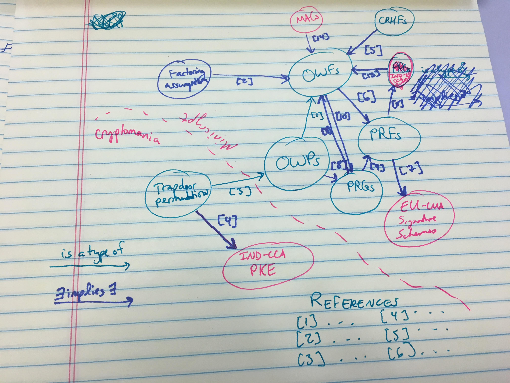

# Map of Crypto

### What's a map of crypto?
* A project I hope to build (with your help!) over the next few months.
* A "map" (DAG) of crypto primitives, and the relationships between them!
  Haven't you ever been sitting around thinking, "darn it, where's the
  reference saying that OWFs imply PRFs, I want to check something."
* Publicly accessible on the Internet so it's easy to check!
* Easy to contribute to, as much or as little as you want to!
* Eventually, will have a nice interface that lets you explore relationships
  between these various objects, and the objects themselves.

### It will look something like this, hopefully.

### Contributions
* **TL;DR:**
    * **If you want to be a main submitter for the next couple months while we
      get this thing started:** send me an email saying so with "map of crypto"
      in the subject.
    * **If you want to follow this project and maybe submit/verify one or two
      things but not more:** Watch it on github and feel free to submit a PR once
      there are instructions on how to do so.
    * **Regardless of whether or not you want to participate in the future,** 
      I'd love any feedback you can give me right now in response to this
      message with advice, criticisms, concerns, etc.  Send me an email!
* Once we start building, I anticipate two kinds of submissions:
    * Submit a new node/edge.
        * Find a new primitive and connect it to the map, or find an edge that
          hasn't been looked into yet and look into it.
    * Verify a node/edge.
        * Follow the citaiton listed by the submitter and make sure it's actually
          correct.  This should take less time, but it's one of the most important
          facets of this.
* If we end up with about `n=20` primitives and about `m=3` non-mutually-exclusive 
  link types, then... we're potentially considering `O(mn^2) = 1200` tasks.  That's 
  a *lot*, and that's a *low* estimate.  It'll be more if we get more complicated 
  and try to do anything that involves more than two
  nodes at once.  But, first of all, a lot of those can get ruled out
  immediately, and second of all, there is a lot of value in a
  partially-completed map.  It doesn't matter if we haven't addressed a large
  chunk of the links.  I foresee getting a couple hundred links done this
  summer, and then slowing down to finish it over a longer period of time.

### What this map is and what it isn't
* **What it is:** A helpful crypto reference. 
    * If you know what you're looking for, it should be a helpful way to 
      double-check it.
    * You should be able to trace everything back to the assumptions used.
* **What it is not:** A textbook.
    * If you don't know what you're looking for, it won't give
      you a full description of it (though it may link you to one).
    * Another consequence of the "not a textbook" property is that it won't 
      have everything.  Since it's not a textbook, it doesn't have to talk
      about, for instance, "encrypt-then-mac".

### Goals:
* Each node/edge has been verified by at least one person that did not submit
  it.  (Hopefully this will help us catch errors.)
* Soundness is more important than completeness.
* Relationships between objects should be visually apparent.
* It should be easy to find references to where info came from (links to
  papers with proofs, etc).  You should never have to "just trust" this
  reference.

### Things I'm not sure how to do
* If/how to represent "transforms" (think Fiat-Shamir, or Merkle-Damgard)
* How many different kinds of "objects" to have.  There are some clear
  "primitives" (e.g. "strong pseudorandom permutations").  There are some clear
  "schemes" (e.g. "CCA-secure symmetric-key encryption scheme").  There are
  some clear "assumptions" (e.g. "decisional Diffie-Hellman").  But do some
  "types" of objects deserve to be their own object, or no?  For instance: what
  do we do with "collision resistant hash functions"?  SHould they be their own
  thing?  Included in HFs?  Not included at all?  What about t-universal HFs?
* Possibly "assumptions" should be a *property* of nodes/edges, rather than
  nodes themselves.
* Should multi-hop links stay multi-hop?  E.g., if A implies B, B implies C,
  and C implies D, then should there be arrows directly from A-C and A-D as
  well?

### Future goals:
* Clicking on an object should give you either links to constructions, or a
  brief description of the construction itself
* Show (current or provably best) blowup. Whenver possible, include this info
  in links between objects.

